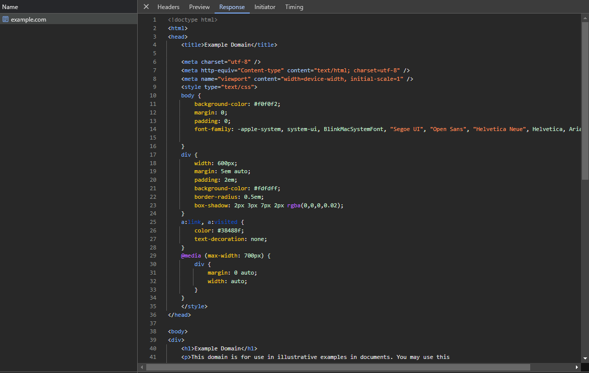

# Chrome DevTools


Pour plus d'information, rendez vous sur la documentation officielle du DevTools, [https://developer.chrome.com/docs/devtools/network](https://developer.chrome.com/docs/devtools/network) !


## Localisation dans le DevTools

Lorsque vous ouvrez le DevTools (avec F12 ou CTRL+SHIFT+I), vous pourrez aller dans l'onglet "Network" et vous pourrez trouver toutes les requêtes que le navigateur a effectué sur la page actuelle.

<figure><figcaption>
L'onglet "Network" du DevTools
</figcaption></figure>

Si l'onglet n'est pas présent, on peut y accéder en utilisant CTRL+SHIFT+P pour accéder à la palette de commandes et taper "Show Network".

<figure><figcaption>
Palette de commande pour ouvrir l'onglet "Network".
</figcaption></figure>

## Exemple avec un GET sur une page HTML

Lorsque l'on va sur `http://example.com/` nous pouvons voir ici la requête `GET` qui est faite au serveur HTTP de `example.com`.

### En-têtes

Si l'on clique sur une requête, on peut trouver toutes les informations concernant celle-ci.

<figure><figcaption>
L'onglet "Headers" d'une requête dans l'onglet "Network".
</figcaption></figure>

Dans l'onglet Headers, on peut trouver les en-têtes que l'on a envoyé et les en-têtes que l'on a reçu.

### Contenu de la réponse

On peut visualiser le contenu d'une réponse en cliquant sur "Response" (réponse telle quelle) ou "Preview" si le contenu de celle-ci peut être affiché d'une manière plus simple.

<figure><figcaption>
L'onglet "Response" d'une requête dans l'onglet "Network".
</figcaption></figure>

## Exemple avec une requête POST

### En-têtes

<figure><figcaption>
L'onglet "Headers" d'une requête dans l'onglet "Network".
</figcaption></figure>

On peut voir qu'une requête `POST` a été effectuée et que son retour est `200 OK` donc elle s'est bien déroulée.

Dans cette requête `POST`, on a envoyé un contenu au serveur qui est de type "`application/x-www-form-urlencoded`" d'après l'en-tête `Content-Type`.

Ce MIME correspond habituellement à un envoie de formulaire en utilisant un `<form>` dans votre page HTML.

### Contenu de la requête

Dans l'onglet "Payload", on peut voir le contenu envoyé avec notre requête.

<figure><figcaption>
L'onglet "Payload" d'une requête dans l'onglet "Network".
</figcaption></figure>

Lorsqu'on clique sur "view source", on peut voir le contenu qui est réellement envoyé.&#x20;
