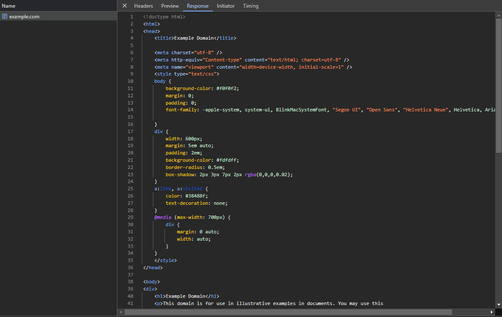

# Connexion

Sachant qu'HTTP est basé sur le protocole TCP, on peut facilement déduire qu'il va nous falloir une connexion TCP à la machine "serveur" depuis notre machine "client".


Pour illustrer cela, nous utiliserons, dans les exemples Node.js, des _sockets._

Les _sockets_ sont des interfaces pour facilement utiliser les protocoles de transport tel que TCP.


## Comment savoir sur quel port est hébergé un serveur HTTP ?

Dans un cas normal, un serveur HTTP est exposé sur le port **80** mais il est possible de configurer ce comportement pour exposer le serveur sur n'importe quel port (8080, par exemple)

Lorsque vous utilisez la notation `http://example.com` dans votre navigateur, celui-ci va tout de suite comprendre que le serveur HTTP est situé au port 80.

Cependant, vous pouvez utiliser la notation `http://example.com:8080` pour expliciter le fait que le serveur HTTP est situé au port 8080.

D'ailleurs vous pouvez écrire `http://example.com:80` et il est très probable que votre navigateur vous renvoie vers `http://example.com`.

Il en va de même pour HTTPS qui est, dans un cas normal, exposé sur le port **443**. Ainsi `http://example.com:443` renvoie vers `https://example.com`.

## Initialisation d'une connexion TCP à la machine "serveur"

Une fois que nous avons le port où est situé le serveur HTTP, il nous faut l'adresse de la machine "serveur" que l'on doit interroger.

Ici, c'est tout simplement `example.com`.\
Le DNS se chargera de faire la résolution de l'adresse IP en fonction du nom de domaine.

Bien, connectons nous à cette machine "serveur" maintenant !


```javascript
// A noter qu'on utilise "node:net" car on se connecte
// sur l'HTTP et non l'HTTPS, sinon il faudrait utiliser "node:tls".
import net from "node:net";

// On initialise le socket.
const socket = net.createConnection({
  // L'adresse de la machine "serveur".
  host: "example.com",
  // Le port du serveur HTTP de la machine "serveur".
  port: 80 // 443 pour HTTPS
});

// On affiche un message lorsque l'on est connecté à la machine "serveur".
socket.once("connect", () => {
  console.log("On est connecté !");
});
```


On peut exécuter ce script en utilisant `node ./index.mjs` et l'on obtient ce résultat sur la console :

<figure><figcaption><p>Execution du script ci-dessus. La connexion a été effectuée.</p></figcaption></figure>

On remarque que notre programme n'est pas _quitté_ instantanément.

La raison est que la connexion TCP est encore active et que le programme restera connecté à la machine "serveur" tant que celle-ci ne nous a pas déconnecté. Une fois déconnecté, le programme est _quitté_ comme prévu.
